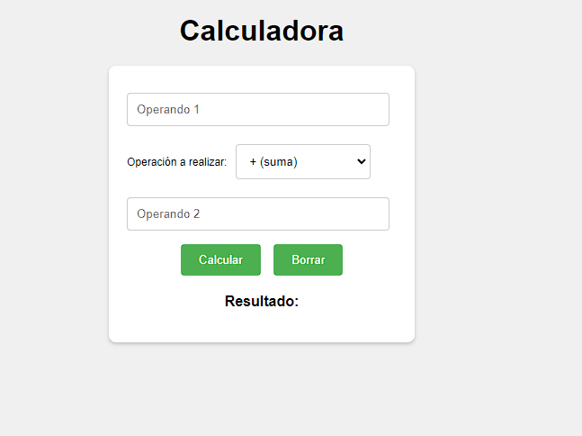

# Calculadora básica

Esta es una calculadora básica implementada con HTML, CSS y JavaScript que te permite realizar operaciones matemáticas simples como suma, resta, multiplicación y división. La calculadora tiene una interfaz de usuario sencilla y fácil de usar.

## Funcionalidades implementadas

- Operaciones matemáticas: Puedes realizar las siguientes operaciones:
  - Suma (+)
  - Resta (-)
  - Multiplicación (*)
  - División (/)

- Operandos decimales: La calculadora permite utilizar números decimales (floats) para realizar las operaciones.

- Validación de operandos: Antes de realizar cualquier operación, la calculadora valida que ambos operandos sean números válidos. Si alguno de los operandos no es válido (no es un número o está vacío), se mostrará un mensaje de error en la interfaz de usuario.

- División por cero: La calculadora maneja la división por cero y muestra un mensaje de error en caso de que se intente dividir por cero.

- Resultados grandes o pequeños: Se ha agregado una verificación para evitar resultados demasiado grandes o pequeños que puedan generar errores o mostrar resultados poco legibles en la interfaz de usuario.

- Botón de borrar: Se ha añadido un botón "Borrar" que permite limpiar los campos de texto y el resultado, lo que facilita realizar nuevas operaciones sin tener que recargar la página.

## Cómo utilizar la calculadora

1. Ingresa el primer operando en el campo de texto "Operando 1".
2. Selecciona el operador deseado en el menú desplegable.
3. Ingresa el segundo operando en el campo de texto "Operando 2".
4. Haz clic en el botón "Calcular" para obtener el resultado de la operación.

El resultado de la operación se mostrará debajo del botón "Calcular". Si alguno de los operandos no es válido o se intenta realizar una división por cero, se mostrará un mensaje de error en lugar del resultado.

Si deseas realizar una nueva operación, puedes hacer clic en el botón "Borrar" para limpiar los campos de texto y el resultado.

**Nota**: Esta calculadora está diseñada para operaciones matemáticas básicas. No es una calculadora científica y no incluye funciones avanzadas como potencias, raíces cuadradas, etc.

## Casos de prueba

1. Suma: 3 + 5
   - Resultado esperado: 8
   - Resultado obtenido: 8

2. Resta: 10 - 7
   - Resultado esperado: 3
   - Resultado obtenido: 3

3. Multiplicación: 2.5 * 4
   - Resultado esperado: 10
   - Resultado obtenido: 10

4. División: 9 / 3
   - Resultado esperado: 3
   - Resultado obtenido: 3

5. División por cero: 7 / 0
   - Resultado esperado: Mensaje de error "Error: La operación no es válida."
   - Resultado obtenido: Mensaje de error "Error: La operación no es válida."

6. Números inválidos: 10 / hola
   - Resultado esperado: Mensaje de error "Error: Ingresa valores numéricos válidos en ambos operandos."
   - Resultado obtenido: Mensaje de error "Error: Ingresa valores numéricos válidos en ambos operandos."

7. Números demasiado grandes: 1e100 + 1e100
   - Resultado esperado: Mensaje de error "Error: El resultado es demasiado grande."
   - Resultado obtenido: Mensaje de error "Error: El resultado es demasiado grande."

8. Números demasiado pequeños: 1 / 1e20
   - Resultado esperado: Mensaje de error "Error: El resultado es demasiado pequeño."
   - Resultado obtenido: Mensaje de error "Error: El resultado es demasiado pequeño."
